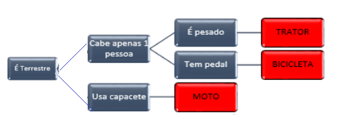

## Desafio

Levando em consideração os aprendizados sobre as estruturas condicionais, elabore um algoritmo que possa descobrir, através de perguntas e respostas, qual é o meio de transporte que o usuário está considerando. O usuário deverá escolher uma das seguintes opções:

- trator; 
- moto; 
- bicicleta. 

Para chegar ao resultado, as perguntas precisam ser respondidas apenas com "Sim" ou "Não".

Exemplo:
É terrestre? Sim.
Cabe apenas uma pessoa? Sim.
É pesado? Não.
Tem pedal? Sim.
Então, o transporte escolhido foi a bicicleta.

Para chegar ao resultado de cada uma das opções, use o modelo em anexo.



## Resolução

```portugol
algoritmo Transporte
var
    terrestre, umaPessoa, pesado, pedal: caractere;

inicio
    escreva("Responda com "Sim" ou "Não");
    escreva("O transporte é terrestre?");
    leia(terrestre);

    escreva("Usa capacete?");
    leia(capacete)

    escreva("Cabe apenas uma pessoa?");
    leia(umaPessoa);

    escreva("É pesado?");
    leia(pesado);

    escreva("Tem pedal?");
    leia(pedal);

    se (terrestre == "Sim")
    {
        se(capacete == "Sim" e umaPessoa == "Não")
        {
            escreva("Então o transporte é uma Moto!);
        }
        senao se(umaPessoa == "Sim" e pesado == "Sim")
        {
            escreva("Então o transporte é um Trator!);
        }
        senao se(umaPessoa == "Sim" e pedal == "Não")
        {
            escreva("Então o transporte é uma Bicicleta!");
        }
        senao
        {
            escreva("Não foi possível descobrir qual é o transporte");
        }
    }
    senao
    {
        escreva("Não foi possível descobrir qual é o transporte");
    }
```