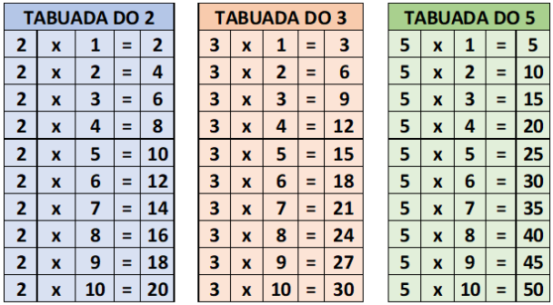

## Desafio

Um aluno do ensino fundamental precisa fazer como tarefa de casa a tabuada de alguns números inteiros, como nos exemplos em anexo.



Para ajudar esse aluno, você deve elaborar um algoritmo que solicite que seja digitado um número inteiro e que no final imprima o resultado da tabuada desse número.


## Resolução

```portugol
algoritmo Tabuada
var
    numero: inteiro;

inicio
    escreva(“Digite um número inteiro: “);
    leia(numero);

    para i de 1 até 10 faça:
	    escreva(numero, “ x “, i, “ = “, numero * i;
    fimpara
fimalgoritmo
```
