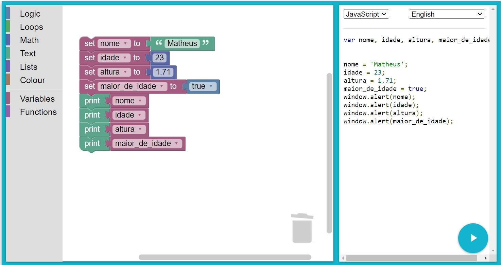

## Desafio

Construa um algoritmo no Blockly que declare as seguintes variáveis: nome, idade, altura e maior_de_idade.

Depois, atribua valores para essas variáveis, sabendo que a variável nome é uma string, a variável idade é um inteiro, a variável altura é um float e a variável maior_de_idade é um booleano.

No final, imprima os valores das variáveis.

## Resolução

